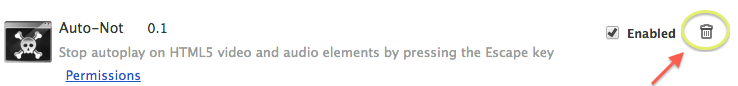

auto-not
========

A Chrome extension to pause autoplaying HTML5 `video` and `audio` content from a Web page. No need to revisit the horrible olden times of [Shockwave or MIDI file ambush](http://xkcd.com/134/).


##Installation
Visit [the Chrome Web Store](https://chrome.google.com/webstore/detail/auto-not/oboppjmmbnkmcemilmahflckpipomcpe), and click to install.

##Removal
* Open `chrome://extensions` in your browser
* Click the traschcan icon to the right of the Auto-not name:


##Usage
When confronted by unwanted motion pictures or sounds, try pressing the "Escape " key. If you have Auto-not installed **and** the annoyances have been brought into the Web page you're trying to read with the HTML5 `autoplay` attribute, you will observe playback paused.

Press ESC again to resume playback.

##Running the tests

- Install [`mocha`](http://visionmedia.github.io/mocha/) and [`chai`](http://chaijs.com/guide/installation/) with NPM:

````
$ npm install mocha
````

````
$ npm install chai
````


- View the unit test results in `test/test.html`.

##Acknowledgements

Much inspiration taken from the wholly essential [Gif Stopper](https://chrome.google.com/webstore/detail/gif-stopper/eaebhojnielfeoillcfnbmkgliokndkm) extension by [Terry Moore](http://motersho.com/blog/).

Much gratitude to testers Robin Pentola and [Erin Joan Snyder](https://github.com/ErinJoan).
